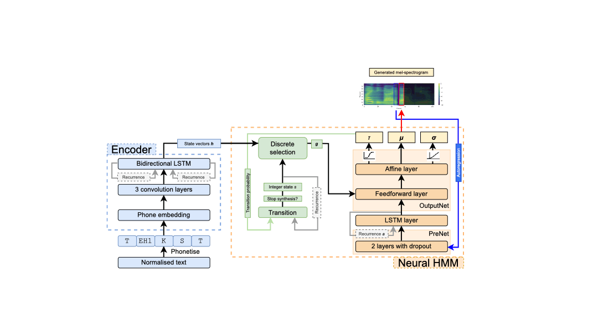

# Neural HMMs are all you need (for high-quality attention-free TTS)
##### [Shivam Mehta][shivam_profile], [Éva Székely][eva_profile], [Jonas Beskow][jonas_profile], and [Gustav Eje Henter][gustav_profile]


<head> 
<link rel="apple-touch-icon" sizes="180x180" href="favicon/apple-touch-icon.png">
<link rel="icon" type="image/png" sizes="32x32" href="favicon/favicon-32x32.png">
<link rel="icon" type="image/png" sizes="16x16" href="favicon/favicon-16x16.png">
<link rel="manifest" href="/site.webmanifest">
<link rel="mask-icon" href="/safari-pinned-tab.svg" color="#5bbad5">
<meta name="msapplication-TileColor" content="#da532c">
<meta name="theme-color" content="#ffffff">
</head>
<!-- This page presents audio examples of neural TTS using neural hidden Markov models instead of attention, as published at ICASSP 2022. -->

[arxiv_link]: https://arxiv.org/abs/2108.13320
[github_link]: https://github.com/shivammehta007/Neural-HMM
[shivam_profile]: https://www.kth.se/profile/smehta
[eva_profile]: https://www.kth.se/profile/szekely
[jonas_profile]: https://www.kth.se/profile/beskow
[gustav_profile]: https://people.kth.se/~ghe/
[HiFi_GAN_LJ_FT_V1_link]: https://github.com/jik876/hifi-gan#pretrained-model

## Summary

We show that classic, HMM-based speech synthesis and modern, neural text-to-speech (TTS) can be combined to obtain the best of both worlds. Concretely, our proposal amounts to replacing conventional attention in neural TTS by so-called neural HMMs. We call this new approach “neural HMM TTS”.

To validate our proposal, we describe a modified version of Tacotron 2 that uses neural HMMs instead of attention. The resulting system:
* Is smaller and simpler than Tacotron 2
* Learns to speak and align much quicker
* Does not risk breaking down into gibberish
* Is fully probabilistic
* Allows easy control over speaking rate
* Achieves the same naturalness as Tacotron 2

To our knowledge, this is the first time HMM-based speech synthesis has achieved a speech quality on par with neural TTS.

For more information, please [read our ICASSP 2022 paper here][arxiv_link].

## Architecture

<!--  -->


<!-- ## Web Example
<iframe url="http://130.237.67.68:8501/" height="400" width="100%" title="Web Example"> </iframe> -->

## Code

Code is available in our [Github repository][github_link], along with a pre-trained model.

## Listening examples

<style type="text/css">
  .tg {
    border-collapse: collapse;
    border-color: #9ABAD9;
    border-spacing: 0;
  }

  .tg td {
    background-color: #EBF5FF;
    border-color: #9ABAD9;
    border-style: solid;
    border-width: 1px;
    color: #444;
    font-family: Arial, sans-serif;
    font-size: 14px;
    overflow: hidden;
    padding: 0px 20px;
    word-break: normal;
    font-weight: bold;
    vertical-align: middle;
  }

  .tg th {
    background-color: #409cff;
    border-color: #9ABAD9;
    border-style: solid;
    border-width: 1px;
    color: #fff;
    font-family: Arial, sans-serif;
    font-size: 14px;
    font-weight: normal;
    overflow: hidden;
    padding: 0px 20px;
    word-break: normal;
    font-weight: bold;
    vertical-align: middle;

  }

  .tg .tg-0pky {
    border-color: inherit;
    text-align: center;
    vertical-align: top,
  }

  .tg .tg-fymr {
    border-color: inherit;
    font-weight: bold;
    text-align: center;
    vertical-align: top
  }
  .slider {
  -webkit-appearance: none;
  width: 75%;
  height: 15px;
  border-radius: 5px;  
  background: #d3d3d3;
  outline: none;
  opacity: 0.7;
  -webkit-transition: .2s;
  transition: opacity .2s;
}

.slider::-webkit-slider-thumb {
  -webkit-appearance: none;
  appearance: none;
  width: 25px;
  height: 25px;
  border-radius: 50%; 
  background: #409cff;
  cursor: pointer;
}

.slider::-moz-range-thumb {
  width: 25px;
  height: 25px;
  border-radius: 50%;
  background: #409cff;
  cursor: pointer;
}
</style>

### Stimuli from listening test

<table class="tg">
  <thead>
    <tr>
      <th class="tg-0pky">Type</th>
      <th class="tg-0pky" colspan="2">Proposed neural HMM TTS</th>
      <th class="tg-0pky" colspan="2">Tacotron 2 baseline</th>
    </tr>
  </thead>
  <tbody>
    <tr>
      <th class="tg-fymr">Condition</th>
      <th class="tg-fymr">2 states per phone (NH2)</th>
      <th class="tg-fymr">1 state per phone (NH1)</th>
      <th class="tg-fymr">w/o post-net (T2-P)</th>
      <th class="tg-fymr">w/ post-net (T2+P)</th>
    </tr>
    <tr>
      <td nowrap class="tg-0pky"><b>Sentence 1</b></td>
      <td class="tg-0pky">
        <audio id="audio-small" controls>
          <source src="./audio/NeuralHMM/2State/NeuralHMM1AR2State_hvd_001.wav" type="audio/wav">
        </audio>
      </td>
      <td class="tg-0pky">
        <audio controls>
          <source src="./audio/NeuralHMM/1State/NeuralHMM1AR1State_hvd_001.wav" type="audio/wav">
        </audio>
      </td>
      <td class="tg-0pky">
        <audio controls>
          <source src="./audio/Tacotron/TacotronWOPostnet/Tacotron_hvd_001.wav" type="audio/wav">
        </audio>
      </td>
      <td class="tg-0pky">
        <audio controls>
          <source src="./audio/Tacotron/TacotronWPostnet/Tacotron_Postnet_hvd_001.wav" type="audio/wav">
        </audio>
      </td>
    </tr>
    <tr>
      <td nowrap class="tg-0pky"><b>Sentence 2</b></td>
      <td class="tg-0pky">
        <audio controls>
          <source src="./audio/NeuralHMM/2State/NeuralHMM1AR2State_hvd_002.wav" type="audio/wav">
        </audio>
      </td>
      <td class="tg-0pky">
        <audio controls>
          <source src="./audio/NeuralHMM/1State/NeuralHMM1AR1State_hvd_002.wav" type="audio/wav">
        </audio>
      </td>
      <td class="tg-0pky">
        <audio controls>
          <source src="./audio/Tacotron/TacotronWOPostnet/Tacotron_hvd_002.wav" type="audio/wav">
        </audio>
      </td>
      <td class="tg-0pky">
        <audio controls>
          <source src="./audio/Tacotron/TacotronWPostnet/Tacotron_Postnet_hvd_002.wav" type="audio/wav">
        </audio>
      </td>
    </tr>
    <tr>
      <td nowrap class="tg-0pky"><b>Sentence 3</b></td>
      <td class="tg-0pky">
        <audio controls>
          <source src="./audio/NeuralHMM/2State/NeuralHMM1AR2State_hvd_003.wav" type="audio/wav">
        </audio>
      </td>
      <td class="tg-0pky">
        <audio controls>
          <source src="./audio/NeuralHMM/1State/NeuralHMM1AR1State_hvd_003.wav" type="audio/wav">
        </audio>
      </td>
      <td class="tg-0pky">
        <audio controls>
          <source src="./audio/Tacotron/TacotronWOPostnet/Tacotron_hvd_003.wav" type="audio/wav">
        </audio>
      </td>
      <td class="tg-0pky">
        <audio controls>
          <source src="./audio/Tacotron/TacotronWPostnet/Tacotron_Postnet_hvd_003.wav" type="audio/wav">
        </audio>
      </td>
    </tr>
    <tr>
      <td nowrap class="tg-0pky"><b>Sentence 4</b></td>
      <td class="tg-0pky">
        <audio controls>
          <source src="./audio/NeuralHMM/2State/NeuralHMM1AR2State_hvd_004.wav" type="audio/wav">
        </audio>
      </td>
      <td class="tg-0pky">
        <audio controls>
          <source src="./audio/NeuralHMM/1State/NeuralHMM1AR1State_hvd_004.wav" type="audio/wav">
        </audio>
      </td>
      <td class="tg-0pky">
        <audio controls>
          <source src="./audio/Tacotron/TacotronWOPostnet/Tacotron_hvd_004.wav" type="audio/wav">
        </audio>
      </td>
      <td class="tg-0pky">
        <audio controls>
          <source src="./audio/Tacotron/TacotronWPostnet/Tacotron_Postnet_hvd_004.wav" type="audio/wav">
        </audio>
      </td>
    </tr>
    <tr>
      <td nowrap class="tg-0pky"><b>Sentence 5</b></td>
      <td class="tg-0pky">
        <audio controls>
          <source src="./audio/NeuralHMM/2State/NeuralHMM1AR2State_hvd_005.wav" type="audio/wav">
        </audio>
      </td>
      <td class="tg-0pky">
        <audio controls>
          <source src="./audio/NeuralHMM/1State/NeuralHMM1AR1State_hvd_005.wav" type="audio/wav">
        </audio>
      </td>
      <td class="tg-0pky">
        <audio controls>
          <source src="./audio/Tacotron/TacotronWOPostnet/Tacotron_hvd_005.wav" type="audio/wav">
        </audio>
      </td>
      <td class="tg-0pky">
        <audio controls>
          <source src="./audio/Tacotron/TacotronWPostnet/Tacotron_Postnet_hvd_005.wav" type="audio/wav">
        </audio>
      </td>
    </tr>
    <tr>
      <td nowrap class="tg-0pky"><b>Sentence 6</b></td>
      <td class="tg-0pky">
        <audio controls>
          <source src="./audio/NeuralHMM/2State/NeuralHMM1AR2State_hvd_006.wav" type="audio/wav">
        </audio>
      </td>
      <td class="tg-0pky">
        <audio controls>
          <source src="./audio/NeuralHMM/1State/NeuralHMM1AR1State_hvd_006.wav" type="audio/wav">
        </audio>
      </td>
      <td class="tg-0pky">
        <audio controls>
          <source src="./audio/Tacotron/TacotronWOPostnet/Tacotron_hvd_006.wav" type="audio/wav">
        </audio>
      </td>
      <td class="tg-0pky">
        <audio controls>
          <source src="./audio/Tacotron/TacotronWPostnet/Tacotron_Postnet_hvd_006.wav" type="audio/wav">
        </audio>
      </td>
    </tr>
  </tbody>
</table>

### Learning to speak and align quickly


<div class="slidecontainer">
  <label for="itr_slider"><span style="font-weight:bold"> 0.5k </span></label>
  <input type="range" min="0" max="15" value="15" class="slider" id="itr_slider">
  <label for="itr_slider"><span style="font-weight:bold"> 30k </span> </label>
  <p><span style="font-weight:bold">Number of training iterations:</span> <span class="itr_val"></span>
  </p>
</div>
<table class="tg">
  <thead>
    <tr>
      <th class="tg-0pky">Model</th>
      <th class="tg-0pky">Utterance at iteration: <span class="itr_val"></span> </th>
    </tr>
  </thead>
  <tbody>
    <tr>
      <td class="tg-0pky">
        <span style="font-weight:bold">NH2</span>
      </td>
      <td class="tg-0pky">
        <audio controls id="control_chckpt_itr_nh2">
          <source id="nh2_checkpt_itr" src="./audio/NeuralHMM/2State/TrainingIterations/NeuralHMM1AR2State_update_30000.wav" type="audio/wav">
        </audio>
      </td>
    </tr>
    <tr>
      <td class="tg-0pky">
        <span style="font-weight:bold">T2-P</span>
      </td>
      <td class="tg-0pky">
        <audio controls id="control_chckpt_itr_t2_p">
          <source id="t2_p_checkpt_itr" src="./audio/Tacotron/TacotronWOPostnet/TrainingIterations/Tacotron_utterance_update_30000.wav" type="audio/wav">
        </audio>
      </td>
    </tr>
    <tr>
      <td class="tg-0pky">
        <span style="font-weight:bold">NH2 (500 utterances)</span>
      </td>
      <td class="tg-0pky">
        <audio controls id="control_chckpt_itr_nh2_500">
          <source id="nh2_500_checkpt_itr" src="./audio/NeuralHMM/2State/TrainingIterations/NeuralHMM1AR2State_500_utterance_update_30000.wav" type="audio/wav">
        </audio>
      </td>
    </tr>
    <tr>
      <td class="tg-0pky">
        <span style="font-weight:bold">T2-P (500 utterances)</span>
      </td>
      <td class="tg-0pky">
        <audio controls id="control_chckpt_itr_t2_p_500">
          <source id="t2_p_500_checkpt_itr" src="./audio/Tacotron/TacotronWOPostnet/TrainingIterations/Tacotron_500_utterance_update_30000.wav" type="audio/wav">
        </audio>
      </td>
    </tr>
  </tbody>
</table>
<script>
  var itr_slider = document.getElementById("itr_slider");
  var itr_vals = document.getElementsByClassName("itr_val");
  // Sentences
  //NH2
  var nh2_chckpt_itr = document.getElementById("nh2_checkpt_itr");
  var control_chckpt_itr_nh2 = document.getElementById('control_chckpt_itr_nh2');
  //T2-P
  var t2_p_checkpt_itr = document.getElementById('t2_p_checkpt_itr');
  var control_chckpt_itr_t2_p = document.getElementById("control_chckpt_itr_t2_p");
  //NH2 (500 utterances)
  var nh2_500_checkpt_itr = document.getElementById("nh2_500_checkpt_itr");
  var control_chckpt_itr_nh2_500 = document.getElementById('control_chckpt_itr_nh2_500');
  //T2-P (500 utterances)
  var t2_p_500_checkpt_itr = document.getElementById("t2_p_500_checkpt_itr");
  var control_chckpt_itr_t2_p_500 = document.getElementById('control_chckpt_itr_t2_p_500');
  // Functions to update values
  var iterations = {
                     0: ['0.5k', 500],
                     1: ['1k', 1000],  
                     2: ['1.5k', 1500], 
                     3: ['2k', 2000],  
                     4: ['2.5k', 2500], 
                     5: ['5k', 5000], 
                     6: ['7.5k', 7500], 
                     7: ['10k', 10000], 
                     8: ['12.5k', 12500], 
                     9: ['15k', 15000], 
                     10: ['17.5k', 17500], 
                     11: ['20k', 20000], 
                     12: ['22.5k', 22500], 
                     13: ['25k', 25000], 
                     14: ['27.5k', 27500], 
                     15: ['30k', 30000]
  };
  function updateVals(classes, value){
    for(var i=0; i < classes.length; i++) {
        classes[i].innerHTML= iterations[parseInt(value)][0];
    }
  }
  updateVals(itr_vals, 15);
  itr_slider.oninput = function() {
    updateVals(itr_vals, this.value);
    let iteration = iterations[parseInt(this.value)][1];
    // Update sources
    nh2_chckpt_itr.src = "./audio/NeuralHMM/2State/TrainingIterations/NeuralHMM1AR2State_update_" + iteration + ".wav"
    t2_p_checkpt_itr.src = "./audio/Tacotron/TacotronWOPostnet/TrainingIterations/Tacotron_utterance_update_" + iteration + ".wav"
    nh2_500_checkpt_itr.src = "./audio/NeuralHMM/2State/TrainingIterations/NeuralHMM1AR2State_500_utterance_update_" + iteration + ".wav"
    t2_p_500_checkpt_itr.src = "./audio/Tacotron/TacotronWOPostnet/TrainingIterations/Tacotron_500_utterance_update_" + iteration + ".wav"
    // Reload audio
    control_chckpt_itr_nh2.load();
    control_chckpt_itr_t2_p.load();
    control_chckpt_itr_nh2_500.load();
    control_chckpt_itr_t2_p_500.load();
  }
</script>


### Speaking sentences Tacotron 2 cannot speak

<table class="tg">
<thead>
  <tr>
    <th class="tg-0pky"></th>
    <th class="tg-0pky"><span style="font-weight:600;font-style:normal">Neural HMM (NH2)</span></th>
    <th class="tg-0pky"><span style="font-weight:600;font-style:normal">Tacotron 2 (T2-P)</span></th>
    <th class="tg-0pky"><span style="font-weight:600;font-style:normal"> <a href="https://github.com/NVIDIA/tacotron2" style="color:white;font-weight:bold">Pre-trained NVIDIA Tacotron 2</a> </span></th>
  </tr>
</thead>
<tbody>
  <tr>
    <td nowrap class="tg-0pky"><b>Example 1</b></td>
    <td class="tg-0pky">
        <audio controls>
            <source src="./audio/NeuralHMM/2State/ComplexSentences/NeuralHMM1AR2State_example_1.wav" type="audio/wav">
        </audio>
    </td>
    <td class="tg-0pky">
        <audio controls>
            <source src="./audio/NeuralHMM/2State/ComplexSentences/Tacotron_example_1.wav" type="audio/wav">
        </audio>
    </td>
    <td class="tg-0pky">
        <audio controls>
            <source src="./audio/NeuralHMM/2State/ComplexSentences/NVIDIATacotron_example_1.wav" type="audio/wav">
        </audio>
    </td>
  </tr>
    <tr>
    <td class="tg-0pky"><b>Example 2</b></td>
    <td class="tg-0pky">
        <audio controls>
            <source src="./audio/NeuralHMM/2State/ComplexSentences/NeuralHMM1AR2State_example_2.wav" type="audio/wav">
        </audio>
    </td>
    <td class="tg-0pky">
        <audio controls>
            <source src="./audio/NeuralHMM/2State/ComplexSentences/Tacotron_example_2.wav" type="audio/wav">
        </audio>
    </td>
    <td class="tg-0pky">
        <audio controls>
            <source src="./audio/NeuralHMM/2State/ComplexSentences/NVIDIATacotron_example_2.wav" type="audio/wav">
        </audio>
    </td>
  </tr>
    <tr>
    <td class="tg-0pky"><b>Example 3</b></td>
    <td class="tg-0pky">
        <audio controls>
            <source src="./audio/NeuralHMM/2State/ComplexSentences/NeuralHMM1AR2State_example_3.wav" type="audio/wav">
        </audio>
    </td>
    <td class="tg-0pky">
        <audio controls>
            <source src="./audio/NeuralHMM/2State/ComplexSentences/Tacotron_example_3.wav" type="audio/wav">
        </audio>
    </td>
    <td class="tg-0pky">
        <audio controls>
            <source src="./audio/NeuralHMM/2State/ComplexSentences/NVIDIATacotron_example_3.wav" type="audio/wav">
        </audio>
    </td>
  </tr>
    <tr>
    <td class="tg-0pky"><b>Example 4</b></td>
    <td class="tg-0pky">
        <audio controls>
            <source src="./audio/NeuralHMM/2State/ComplexSentences/NeuralHMM1AR2State_example_4.wav" type="audio/wav">
        </audio>
    </td>
    <td class="tg-0pky">
        <audio controls>
            <source src="./audio/NeuralHMM/2State/ComplexSentences/Tacotron_example_4.wav" type="audio/wav">
        </audio>
    </td>
    <td class="tg-0pky">
        <audio controls>
            <source src="./audio/NeuralHMM/2State/ComplexSentences/NVIDIATacotron_example_4.wav" type="audio/wav">
        </audio>
    </td>
  </tr>
</tbody>
</table>

### Effect of different output-generation methods


<table class="tg">
  <thead>
    <tr>
      <th class="tg-0pky"></th>
      <th class="tg-0pky" colspan="4">Neural HMM TTS (model NH2)</th>
    </tr>
    <tr>
      <th class="tg-0pky">Durations</th>
      <th class="tg-0pky">Quantile</th>
      <th class="tg-0pky">Sampled</th>
      <th class="tg-0pky">Quantile</th>
      <th class="tg-0pky">Sampled</th>
    </tr>
    <tr>
      <th class="tg-0pky">Acoustics </th>
      <th class="tg-0pky">Mean </th>
      <th class="tg-0pky">Mean </th>
      <th class="tg-0pky">Sampled </th>
      <th class="tg-0pky">Sampled </th>
    </tr>
  </thead>
  <tbody>
    <tr>
      <td nowrap class="tg-0pky">
        <b>Sentence 1</b>
      </td>
      <td class="tg-0pky">
        <audio controls>
          <source src="./audio/NeuralHMM/2State/DifferentSettings/NeuralHMM1AR2State_QY_SN_hvd_001.wav" type="audio/wav">
        </audio>
      </td>
      <td class="tg-0pky">
        <audio controls>
          <source src="./audio/NeuralHMM/2State/DifferentSettings/NeuralHMM1AR2State_QN_SN_hvd_001.wav" type="audio/wav">
        </audio>
      </td>
      <td class="tg-0pky">
        <audio controls>
          <source src="./audio/NeuralHMM/2State/DifferentSettings/NeuralHMM1AR2State_QY_SY_hvd_001.wav" type="audio/wav">
        </audio>
      </td>
      <td class="tg-0pky">
        <audio controls>
          <source src="./audio/NeuralHMM/2State/DifferentSettings/NeuralHMM1AR2State_QN_SY_hvd_001.wav" type="audio/wav">
        </audio>
      </td>
    </tr>
    <tr>
      <td nowrap class="tg-0pky">
        <b> Sentence 2</b>
      </td>
      <td class="tg-0pky">
        <audio controls>
          <source src="./audio/NeuralHMM/2State/DifferentSettings/NeuralHMM1AR2State_QY_SN_hvd_002.wav" type="audio/wav">
        </audio>
      </td>
      <td class="tg-0pky">
        <audio controls>
          <source src="./audio/NeuralHMM/2State/DifferentSettings/NeuralHMM1AR2State_QN_SN_hvd_002.wav" type="audio/wav">
        </audio>
      </td>
      <td class="tg-0pky">
        <audio controls>
          <source src="./audio/NeuralHMM/2State/DifferentSettings/NeuralHMM1AR2State_QY_SY_hvd_002.wav" type="audio/wav">
        </audio>
      </td>
      <td class="tg-0pky">
        <audio controls>
          <source src="./audio/NeuralHMM/2State/DifferentSettings/NeuralHMM1AR2State_QN_SY_hvd_002.wav" type="audio/wav">
        </audio>
      </td>
    </tr>
    <tr>
      <td nowrap class="tg-0pky">
        <b> Sentence 3</b>
      </td>
      <td class="tg-0pky">
        <audio controls>
          <source src="./audio/NeuralHMM/2State/DifferentSettings/NeuralHMM1AR2State_QY_SN_hvd_003.wav" type="audio/wav">
        </audio>
      </td>
      <td class="tg-0pky">
        <audio controls>
          <source src="./audio/NeuralHMM/2State/DifferentSettings/NeuralHMM1AR2State_QN_SN_hvd_003.wav" type="audio/wav">
        </audio>
      </td>
      <td class="tg-0pky">
        <audio controls>
          <source src="./audio/NeuralHMM/2State/DifferentSettings/NeuralHMM1AR2State_QY_SY_hvd_003.wav" type="audio/wav">
        </audio>
      </td>
      <td class="tg-0pky">
        <audio controls>
          <source src="./audio/NeuralHMM/2State/DifferentSettings/NeuralHMM1AR2State_QN_SY_hvd_003.wav" type="audio/wav">
        </audio>
      </td>
    </tr>
    <tr>
      <td nowrap class="tg-0pky">
        <b> Sentence 4</b>
      </td>
      <td class="tg-0pky">
        <audio controls>
          <source src="./audio/NeuralHMM/2State/DifferentSettings/NeuralHMM1AR2State_QY_SN_hvd_004.wav" type="audio/wav">
        </audio>
      </td>
      <td class="tg-0pky">
        <audio controls>
          <source src="./audio/NeuralHMM/2State/DifferentSettings/NeuralHMM1AR2State_QN_SN_hvd_004.wav" type="audio/wav">
        </audio>
      </td>
      <td class="tg-0pky">
        <audio controls>
          <source src="./audio/NeuralHMM/2State/DifferentSettings/NeuralHMM1AR2State_QY_SY_hvd_004.wav" type="audio/wav">
        </audio>
      </td>
      <td class="tg-0pky">
        <audio controls>
          <source src="./audio/NeuralHMM/2State/DifferentSettings/NeuralHMM1AR2State_QN_SY_hvd_004.wav" type="audio/wav">
        </audio>
      </td>
    </tr>
    <tr>
      <td nowrap class="tg-0pky">
        <b> Sentence 5</b>
      </td>
      <td class="tg-0pky">
        <audio controls>
          <source src="./audio/NeuralHMM/2State/DifferentSettings/NeuralHMM1AR2State_QY_SN_hvd_005.wav" type="audio/wav">
        </audio>
      </td>
      <td class="tg-0pky">
        <audio controls>
          <source src="./audio/NeuralHMM/2State/DifferentSettings/NeuralHMM1AR2State_QN_SN_hvd_005.wav" type="audio/wav">
        </audio>
      </td>
      <td class="tg-0pky">
        <audio controls>
          <source src="./audio/NeuralHMM/2State/DifferentSettings/NeuralHMM1AR2State_QY_SY_hvd_005.wav" type="audio/wav">
        </audio>
      </td>
      <td class="tg-0pky">
        <audio controls>
          <source src="./audio/NeuralHMM/2State/DifferentSettings/NeuralHMM1AR2State_QN_SY_hvd_005.wav" type="audio/wav">
        </audio>
      </td>
    </tr>
    <tr>
      <td nowrap class="tg-0pky">
        <b> Sentence 6</b>
      </td>
      <td class="tg-0pky">
        <audio controls>
          <source src="./audio/NeuralHMM/2State/DifferentSettings/NeuralHMM1AR2State_QY_SN_hvd_006.wav" type="audio/wav">
        </audio>
      </td>
      <td class="tg-0pky">
        <audio controls>
          <source src="./audio/NeuralHMM/2State/DifferentSettings/NeuralHMM1AR2State_QN_SN_hvd_006.wav" type="audio/wav">
        </audio>
      </td>
      <td class="tg-0pky">
        <audio controls>
          <source src="./audio/NeuralHMM/2State/DifferentSettings/NeuralHMM1AR2State_QY_SY_hvd_006.wav" type="audio/wav">
        </audio>
      </td>
      <td class="tg-0pky">
        <audio controls>
          <source src="./audio/NeuralHMM/2State/DifferentSettings/NeuralHMM1AR2State_QN_SY_hvd_006.wav" type="audio/wav">
        </audio>
      </td>
    </tr>
  </tbody>
</table>


### Effect of pre-net dropout during synthesis

<table class="tg">
<thead>
  <tr>
    <th class="tg-0pky"></th>
    <th class="tg-0pky" colspan="4">Neural HMM TTS (model NH2)</th>
  </tr>
   <tr>
    <th class="tg-0pky"><span style="font-weight:bold">Pre-net dropout?</span></th>
    <th class="tg-0pky">&#x274C;</th>
    <th class="tg-0pky">&#x2705;</th>
    <th class="tg-0pky">&#x2705;</th>
    <th class="tg-0pky">&#x2705;</th>
  </tr>
  <tr>
    <th class="tg-0pky">Output</th>
    <th class="tg-0pky"><span style="font-weight:bold">Same every time </span></th>
    <th class="tg-0pky"><span style="font-weight:bold">Example 1</span></th>
    <th class="tg-0pky"><span style="font-weight:bold">Example 2</span></th>
    <th class="tg-0pky"><span style="font-weight:bold">Example 3</span></th>
  </tr>
</thead>
<tbody>
  <tr>
    <td nowrap class="tg-0pky"><span style="font-weight:bold">Sentence 1</span></td>
    <td class="tg-0pky">
        <audio controls>
          <source src="./audio/NeuralHMM/2State/PrenetDropoutSettings/NeuralHMM1AR2State_ND_hvd_001.wav" type="audio/wav">
        </audio>
    </td>
    <td class="tg-0pky">
        <audio controls>
          <source src="./audio/NeuralHMM/2State/PrenetDropoutSettings/NeuralHMM1AR2State_D_1_hvd_001.wav" type="audio/wav">
        </audio>
    </td>
    <td class="tg-0pky">
    <audio controls>
          <source src="./audio/NeuralHMM/2State/PrenetDropoutSettings/NeuralHMM1AR2State_D_2_hvd_001.wav" type="audio/wav">
    </audio>
    </td>
    <td class="tg-0pky">
    <audio controls>
          <source src="./audio/NeuralHMM/2State/PrenetDropoutSettings/NeuralHMM1AR2State_D_3_hvd_001.wav" type="audio/wav">
    </audio>
    </td>
  </tr>
    <tr>
    <td class="tg-0pky"><span style="font-weight:bold">Sentence 2</span></td>
    <td class="tg-0pky">
        <audio controls>
          <source src="./audio/NeuralHMM/2State/PrenetDropoutSettings/NeuralHMM1AR2State_ND_hvd_002.wav" type="audio/wav">
        </audio>
    </td>
    <td class="tg-0pky">
        <audio controls>
          <source src="./audio/NeuralHMM/2State/PrenetDropoutSettings/NeuralHMM1AR2State_D_1_hvd_002.wav" type="audio/wav">
        </audio>
    </td>
    <td class="tg-0pky">
    <audio controls>
          <source src="./audio/NeuralHMM/2State/PrenetDropoutSettings/NeuralHMM1AR2State_D_2_hvd_002.wav" type="audio/wav">
    </audio>
    </td>
    <td class="tg-0pky">
    <audio controls>
          <source src="./audio/NeuralHMM/2State/PrenetDropoutSettings/NeuralHMM1AR2State_D_3_hvd_002.wav" type="audio/wav">
    </audio>
    </td>
  </tr>
    <tr>
    <td class="tg-0pky"><span style="font-weight:bold">Sentence 3</span></td>
    <td class="tg-0pky">
        <audio controls>
          <source src="./audio/NeuralHMM/2State/PrenetDropoutSettings/NeuralHMM1AR2State_ND_hvd_003.wav" type="audio/wav">
        </audio>
    </td>
    <td class="tg-0pky">
        <audio controls>
          <source src="./audio/NeuralHMM/2State/PrenetDropoutSettings/NeuralHMM1AR2State_D_1_hvd_003.wav" type="audio/wav">
        </audio>
    </td>
    <td class="tg-0pky">
    <audio controls>
          <source src="./audio/NeuralHMM/2State/PrenetDropoutSettings/NeuralHMM1AR2State_D_2_hvd_003.wav" type="audio/wav">
    </audio>
    </td>
    <td class="tg-0pky">
    <audio controls>
          <source src="./audio/NeuralHMM/2State/PrenetDropoutSettings/NeuralHMM1AR2State_D_3_hvd_003.wav" type="audio/wav">
    </audio>
    </td>
  </tr>
    <tr>
    <td class="tg-0pky"><span style="font-weight:bold">Sentence 4</span></td>
    <td class="tg-0pky">
        <audio controls>
          <source src="./audio/NeuralHMM/2State/PrenetDropoutSettings/NeuralHMM1AR2State_ND_hvd_004.wav" type="audio/wav">
        </audio>
    </td>
    <td class="tg-0pky">
        <audio controls>
          <source src="./audio/NeuralHMM/2State/PrenetDropoutSettings/NeuralHMM1AR2State_D_1_hvd_004.wav" type="audio/wav">
        </audio>
    </td>
    <td class="tg-0pky">
    <audio controls>
          <source src="./audio/NeuralHMM/2State/PrenetDropoutSettings/NeuralHMM1AR2State_D_2_hvd_004.wav" type="audio/wav">
    </audio>
    </td>
    <td class="tg-0pky">
    <audio controls>
          <source src="./audio/NeuralHMM/2State/PrenetDropoutSettings/NeuralHMM1AR2State_D_3_hvd_004.wav" type="audio/wav">
    </audio>
    </td>
  </tr>
    <tr>
    <td class="tg-0pky"><span style="font-weight:bold">Sentence 5</span></td>
    <td class="tg-0pky">
        <audio controls>
          <source src="./audio/NeuralHMM/2State/PrenetDropoutSettings/NeuralHMM1AR2State_ND_hvd_005.wav" type="audio/wav">
        </audio>
    </td>
    <td class="tg-0pky">
        <audio controls>
          <source src="./audio/NeuralHMM/2State/PrenetDropoutSettings/NeuralHMM1AR2State_D_1_hvd_005.wav" type="audio/wav">
        </audio>
    </td>
    <td class="tg-0pky">
    <audio controls>
          <source src="./audio/NeuralHMM/2State/PrenetDropoutSettings/NeuralHMM1AR2State_D_2_hvd_005.wav" type="audio/wav">
    </audio>
    </td>
    <td class="tg-0pky">
    <audio controls>
          <source src="./audio/NeuralHMM/2State/PrenetDropoutSettings/NeuralHMM1AR2State_D_3_hvd_005.wav" type="audio/wav">
    </audio>
    </td>
  </tr>
    <tr>
    <td class="tg-0pky"><span style="font-weight:bold">Sentence 6</span></td>
    <td class="tg-0pky">
        <audio controls>
          <source src="./audio/NeuralHMM/2State/PrenetDropoutSettings/NeuralHMM1AR2State_ND_hvd_006.wav" type="audio/wav">
        </audio>
    </td>
    <td class="tg-0pky">
        <audio controls>
          <source src="./audio/NeuralHMM/2State/PrenetDropoutSettings/NeuralHMM1AR2State_D_1_hvd_006.wav" type="audio/wav">
        </audio>
    </td>
    <td class="tg-0pky">
    <audio controls>
          <source src="./audio/NeuralHMM/2State/PrenetDropoutSettings/NeuralHMM1AR2State_D_2_hvd_006.wav" type="audio/wav">
    </audio>
    </td>
    <td class="tg-0pky">
    <audio controls>
          <source src="./audio/NeuralHMM/2State/PrenetDropoutSettings/NeuralHMM1AR2State_D_3_hvd_006.wav" type="audio/wav">
    </audio>
    </td>
  </tr>
</tbody>
</table>

### Control over speaking rate

Drag the slider to change the speaking rate.

<div class="slidecontainer">
  <label for="myRange"><span style="font-weight:bold"> Slow </span></label>
  <input type="range" min="1" max="8" value="4" class="slider" id="myRange">
  <label for="myRange"><span style="font-weight:bold"> Fast </span> </label>
  <p><span style="font-weight:bold">Duration quantile:</span> <span id="demo"></span>
  </p>
</div>
<table class="tg">
  <thead>
    <tr>
      <th class="tg-0pky">Sentence</th>
      <th class="tg-0pky">Neural HMM TTS (model NH2)</th>
    </tr>
  </thead>
  <tbody>
    <tr>
      <td class="tg-0pky">
        <span style="font-weight:bold">Sentence 1</span>
      </td>
      <td class="tg-0pky">
        <audio controls id="audio1_dq">
          <source id="src_sentence1" src="./audio/NeuralHMM/2State/DurationQuartile/NeuralHMM1AR2State_point4_hvd_001.wav" type="audio/wav">
        </audio>
      </td>
    </tr>
    <tr>
      <td class="tg-0pky">
        <span style="font-weight:bold">Sentence 2</span>
      </td>
      <td class="tg-0pky">
        <audio controls id="audio2_dq">
          <source id="src_sentence2" src="./audio/NeuralHMM/2State/DurationQuartile/NeuralHMM1AR2State_point4_hvd_002.wav" type="audio/wav">
        </audio>
      </td>
    </tr>
    <tr>
      <td class="tg-0pky">
        <span style="font-weight:bold">Sentence 3</span>
      </td>
      <td class="tg-0pky">
        <audio controls id="audio3_dq">
          <source id="src_sentence3" src="./audio/NeuralHMM/2State/DurationQuartile/NeuralHMM1AR2State_point4_hvd_003.wav" type="audio/wav">
        </audio>
      </td>
    </tr>
    <tr>
      <td class="tg-0pky">
        <span style="font-weight:bold">Sentence 4</span>
      </td>
      <td class="tg-0pky">
        <audio controls id="audio4_dq">
          <source id="src_sentence4" src="./audio/NeuralHMM/2State/DurationQuartile/NeuralHMM1AR2State_point4_hvd_004.wav" type="audio/wav">
        </audio>
      </td>
    </tr>
    <tr>
      <td class="tg-0pky">
        <span style="font-weight:bold">Sentence 5</span>
      </td>
      <td class="tg-0pky">
        <audio controls id="audio5_dq">
          <source id="src_sentence5" src="./audio/NeuralHMM/2State/DurationQuartile/NeuralHMM1AR2State_point4_hvd_005.wav" type="audio/wav">
        </audio>
      </td>
    </tr>
    <tr>
      <td class="tg-0pky">
        <span style="font-weight:bold">Sentence 6</span>
      </td>
      <td class="tg-0pky">
        <audio controls id="audio6_dq">
          <source id="src_sentence6" src="./audio/NeuralHMM/2State/DurationQuartile/NeuralHMM1AR2State_point4_hvd_006.wav" type="audio/wav">
        </audio>
      </td>
    </tr>
  </tbody>
</table>
<script>
  var slider = document.getElementById("myRange");
  var output = document.getElementById("demo");
  var src_sentence1 = document.getElementById("src_sentence1");
  var audio1_dq = document.getElementById('audio1_dq');
  var src_sentence2 = document.getElementById("src_sentence2");
  var audio2_dq = document.getElementById('audio2_dq');
  var src_sentence3 = document.getElementById("src_sentence3");
  var audio3_dq = document.getElementById('audio3_dq');
  var src_sentence4 = document.getElementById("src_sentence4");
  var audio4_dq = document.getElementById('audio4_dq');
  var src_sentence5 = document.getElementById("src_sentence5");
  var audio5_dq = document.getElementById('audio5_dq');
  var src_sentence6 = document.getElementById("src_sentence6");
  var audio6_dq = document.getElementById('audio6_dq');
  output.innerHTML = ((10 - slider.value) / 10);
  slider.oninput = function() {
    output.innerHTML = ((10 - this.value) / 10);
    let number = this.value;
    src_sentence1.src = "./audio/NeuralHMM/2State/DurationQuartile/NeuralHMM1AR2State_point" + number + "_hvd_001.wav"
    src_sentence2.src = "./audio/NeuralHMM/2State/DurationQuartile/NeuralHMM1AR2State_point" + number + "_hvd_002.wav"
    src_sentence3.src = "./audio/NeuralHMM/2State/DurationQuartile/NeuralHMM1AR2State_point" + number + "_hvd_003.wav"
    src_sentence4.src = "./audio/NeuralHMM/2State/DurationQuartile/NeuralHMM1AR2State_point" + number + "_hvd_004.wav"
    src_sentence5.src = "./audio/NeuralHMM/2State/DurationQuartile/NeuralHMM1AR2State_point" + number + "_hvd_005.wav"
    src_sentence6.src = "./audio/NeuralHMM/2State/DurationQuartile/NeuralHMM1AR2State_point" + number + "_hvd_006.wav"
    audio1_dq.load();
    audio2_dq.load();
    audio3_dq.load();
    audio4_dq.load();
    audio5_dq.load();
    audio6_dq.load();
  }
</script>


### Effect of using HiFi-GAN and a post-net

These audio samples use a stronger vocoder ([HiFi-GAN version LJ_FT_T2_V1][HiFi_GAN_LJ_FT_V1_link]) and also include a hybrid condition NH2+P that demonstrates the effect of applying the post-net from model T2 to the output of model NH2.

<table class="tg">
  <thead>
    <tr>
      <th class="tg-0pky">Type</th>
      <th class="tg-0pky" colspan="2">Proposed neural HMM TTS</th>
      <th class="tg-0pky" colspan="2">Tacotron 2 baseline</th>
    </tr>
  </thead>
  <tbody>
    <tr>
      <th class="tg-fymr">Condition</th>
      <th class="tg-fymr">2 states per phone (NH2)</th>
      <th class="tg-fymr">NH2 with Tacotron 2's post-net (NH2+P)</th>
      <th class="tg-fymr">w/o post-net (T2-P)</th>
      <th class="tg-fymr">w/ post-net (T2+P)</th>
    </tr>
    <tr>
      <td nowrap class="tg-0pky"><b>Sentence 1</b></td>
      <td class="tg-0pky">
        <audio controls>
          <source src="./audio/NeuralHMM/2State/HiFiGAN/NeuralHMM1AR2State_HiFiGAN_hvd_001.wav" type="audio/wav">
        </audio>
      </td>
      <td class="tg-0pky">
        <audio controls>
          <source src="./audio/NeuralHMM/2State/HiFiGAN/NeuralHMM1AR2State_Postnet_HiFiGAN_hvd_001.wav" type="audio/wav">
        </audio>
      </td>
      <td class="tg-0pky">
        <audio controls>
          <source src="./audio/Tacotron/TacotronWOPostnet/HiFiGAN/Tacotron_HiFiGAN_hvd_001.wav">
        </audio>
      </td>
      <td class="tg-0pky">
        <audio controls>
          <source src="./audio/Tacotron/TacotronWPostnet/HiFiGAN/Tacotron_Postnet_HiFiGAN_hvd_001.wav" type="audio/wav">
        </audio>
      </td>
    </tr>
    <tr>
      <td nowrap class="tg-0pky"><b>Sentence 2</b></td>
      <td class="tg-0pky">
        <audio controls>
          <source src="./audio/NeuralHMM/2State/HiFiGAN/NeuralHMM1AR2State_HiFiGAN_hvd_002.wav" type="audio/wav">
        </audio>
      </td>
      <td class="tg-0pky">
        <audio controls>
          <source src="./audio/NeuralHMM/2State/HiFiGAN/NeuralHMM1AR2State_Postnet_HiFiGAN_hvd_002.wav" type="audio/wav">
        </audio>
      </td>
      <td class="tg-0pky">
        <audio controls>
          <source src="./audio/Tacotron/TacotronWOPostnet/HiFiGAN/Tacotron_HiFiGAN_hvd_002.wav">
        </audio>
      </td>
      <td class="tg-0pky">
        <audio controls>
          <source src="./audio/Tacotron/TacotronWPostnet/HiFiGAN/Tacotron_Postnet_HiFiGAN_hvd_002.wav" type="audio/wav">
        </audio>
      </td>
    </tr>
    <tr>
      <td nowrap class="tg-0pky"><b>Sentence 3</b></td>
      <td class="tg-0pky">
        <audio controls>
          <source src="./audio/NeuralHMM/2State/HiFiGAN/NeuralHMM1AR2State_HiFiGAN_hvd_003.wav" type="audio/wav">
        </audio>
      </td>
      <td class="tg-0pky">
        <audio controls>
          <source src="./audio/NeuralHMM/2State/HiFiGAN/NeuralHMM1AR2State_Postnet_HiFiGAN_hvd_003.wav" type="audio/wav">
        </audio>
      </td>
      <td class="tg-0pky">
        <audio controls>
          <source src="./audio/Tacotron/TacotronWOPostnet/HiFiGAN/Tacotron_HiFiGAN_hvd_003.wav">
        </audio>
      </td>
      <td class="tg-0pky">
        <audio controls>
          <source src="./audio/Tacotron/TacotronWPostnet/HiFiGAN/Tacotron_Postnet_HiFiGAN_hvd_003.wav" type="audio/wav">
        </audio>
      </td>
    </tr>
    <tr>
      <td nowrap class="tg-0pky"><b>Sentence 4</b></td>
      <td class="tg-0pky">
        <audio controls>
          <source src="./audio/NeuralHMM/2State/HiFiGAN/NeuralHMM1AR2State_HiFiGAN_hvd_004.wav" type="audio/wav">
        </audio>
      </td>
      <td class="tg-0pky">
        <audio controls>
          <source src="./audio/NeuralHMM/2State/HiFiGAN/NeuralHMM1AR2State_Postnet_HiFiGAN_hvd_004.wav" type="audio/wav">
        </audio>
      </td>
      <td class="tg-0pky">
        <audio controls>
          <source src="./audio/Tacotron/TacotronWOPostnet/HiFiGAN/Tacotron_HiFiGAN_hvd_004.wav">
        </audio>
      </td>
      <td class="tg-0pky">
        <audio controls>
          <source src="./audio/Tacotron/TacotronWPostnet/HiFiGAN/Tacotron_Postnet_HiFiGAN_hvd_004.wav" type="audio/wav">
        </audio>
      </td>
    </tr>
    <tr>
      <td nowrap class="tg-0pky"><b>Sentence 5</b></td>
      <td class="tg-0pky">
        <audio controls>
          <source src="./audio/NeuralHMM/2State/HiFiGAN/NeuralHMM1AR2State_HiFiGAN_hvd_005.wav" type="audio/wav">
        </audio>
      </td>
      <td class="tg-0pky">
        <audio controls>
          <source src="./audio/NeuralHMM/2State/HiFiGAN/NeuralHMM1AR2State_Postnet_HiFiGAN_hvd_005.wav" type="audio/wav">
        </audio>
      </td>
      <td class="tg-0pky">
        <audio controls>
          <source src="./audio/Tacotron/TacotronWOPostnet/HiFiGAN/Tacotron_HiFiGAN_hvd_005.wav">
        </audio>
      </td>
      <td class="tg-0pky">
        <audio controls>
          <source src="./audio/Tacotron/TacotronWPostnet/HiFiGAN/Tacotron_Postnet_HiFiGAN_hvd_005.wav" type="audio/wav">
        </audio>
      </td>
    </tr>
    <tr>
      <td nowrap class="tg-0pky"><b>Sentence 6</b></td>
      <td class="tg-0pky">
        <audio controls>
          <source src="./audio/NeuralHMM/2State/HiFiGAN/NeuralHMM1AR2State_HiFiGAN_hvd_006.wav" type="audio/wav">
        </audio>
      </td>
      <td class="tg-0pky">
        <audio controls>
          <source src="./audio/NeuralHMM/2State/HiFiGAN/NeuralHMM1AR2State_Postnet_HiFiGAN_hvd_006.wav" type="audio/wav">
        </audio>
      </td>
      <td class="tg-0pky">
        <audio controls>
          <source src="./audio/Tacotron/TacotronWOPostnet/HiFiGAN/Tacotron_HiFiGAN_hvd_006.wav">
        </audio>
      </td>
      <td class="tg-0pky">
        <audio controls>
          <source src="./audio/Tacotron/TacotronWPostnet/HiFiGAN/Tacotron_Postnet_HiFiGAN_hvd_006.wav" type="audio/wav">
        </audio>
      </td>
    </tr>
    <tr>
      <td nowrap class="tg-0pky"><b>Sentence 7</b></td>
      <td class="tg-0pky">
        <audio controls>
          <source src="./audio/NeuralHMM/2State/HiFiGAN/NeuralHMM1AR2State_HiFiGAN_hvd_007.wav" type="audio/wav">
        </audio>
      </td>
      <td class="tg-0pky">
        <audio controls>
          <source src="./audio/NeuralHMM/2State/HiFiGAN/NeuralHMM1AR2State_Postnet_HiFiGAN_hvd_007.wav" type="audio/wav">
        </audio>
      </td>
      <td class="tg-0pky">
        <audio controls>
          <source src="./audio/Tacotron/TacotronWOPostnet/HiFiGAN/Tacotron_HiFiGAN_hvd_007.wav">
        </audio>
      </td>
      <td class="tg-0pky">
        <audio controls>
          <source src="./audio/Tacotron/TacotronWPostnet/HiFiGAN/Tacotron_Postnet_HiFiGAN_hvd_007.wav" type="audio/wav">
        </audio>
      </td>
    </tr>
    <tr>
      <td nowrap class="tg-0pky"><b>Sentence 8</b></td>
      <td class="tg-0pky">
        <audio controls>
          <source src="./audio/NeuralHMM/2State/HiFiGAN/NeuralHMM1AR2State_HiFiGAN_hvd_008.wav" type="audio/wav">
        </audio>
      </td>
      <td class="tg-0pky">
        <audio controls>
          <source src="./audio/NeuralHMM/2State/HiFiGAN/NeuralHMM1AR2State_Postnet_HiFiGAN_hvd_008.wav" type="audio/wav">
        </audio>
      </td>
      <td class="tg-0pky">
        <audio controls>
          <source src="./audio/Tacotron/TacotronWOPostnet/HiFiGAN/Tacotron_HiFiGAN_hvd_008.wav">
        </audio>
      </td>
      <td class="tg-0pky">
        <audio controls>
          <source src="./audio/Tacotron/TacotronWPostnet/HiFiGAN/Tacotron_Postnet_HiFiGAN_hvd_008.wav" type="audio/wav">
        </audio>
      </td>
    </tr>
    <tr>
      <td nowrap class="tg-0pky"><b>Sentence 9</b></td>
      <td class="tg-0pky">
        <audio controls>
          <source src="./audio/NeuralHMM/2State/HiFiGAN/NeuralHMM1AR2State_HiFiGAN_hvd_009.wav" type="audio/wav">
        </audio>
      </td>
      <td class="tg-0pky">
        <audio controls>
          <source src="./audio/NeuralHMM/2State/HiFiGAN/NeuralHMM1AR2State_Postnet_HiFiGAN_hvd_009.wav" type="audio/wav">
        </audio>
      </td>
      <td class="tg-0pky">
        <audio controls>
          <source src="./audio/Tacotron/TacotronWOPostnet/HiFiGAN/Tacotron_HiFiGAN_hvd_009.wav">
        </audio>
      </td>
      <td class="tg-0pky">
        <audio controls>
          <source src="./audio/Tacotron/TacotronWPostnet/HiFiGAN/Tacotron_Postnet_HiFiGAN_hvd_009.wav" type="audio/wav">
        </audio>
      </td>
    </tr>
    <tr>
      <td nowrap class="tg-0pky"><b>Sentence 10</b></td>
      <td class="tg-0pky">
        <audio controls>
          <source src="./audio/NeuralHMM/2State/HiFiGAN/NeuralHMM1AR2State_HiFiGAN_hvd_010.wav" type="audio/wav">
        </audio>
      </td>
      <td class="tg-0pky">
        <audio controls>
          <source src="./audio/NeuralHMM/2State/HiFiGAN/NeuralHMM1AR2State_Postnet_HiFiGAN_hvd_010.wav" type="audio/wav">
        </audio>
      </td>
      <td class="tg-0pky">
        <audio controls>
          <source src="./audio/Tacotron/TacotronWOPostnet/HiFiGAN/Tacotron_HiFiGAN_hvd_010.wav">
        </audio>
      </td>
      <td class="tg-0pky">
        <audio controls>
          <source src="./audio/Tacotron/TacotronWPostnet/HiFiGAN/Tacotron_Postnet_HiFiGAN_hvd_010.wav" type="audio/wav">
        </audio>
      </td>
    </tr>
    
    

  </tbody>
</table>


## Citation information

```
@inproceedings{mehta2022neural,
  title={Neural {HMM}s are all you need (for high-quality attention-free {TTS})},
  author={Mehta, Shivam and Sz{\'e}kely, {\'E}va and Beskow, Jonas and Henter, Gustav Eje},
  booktitle={Proc. ICASSP},
  year={2022}
}
```

<audio controls>
    <source src="./audio/NeuralHMM/thank_you.wav" type="audio/wav">
</audio>


[](https://shivammehta007.github.io/Neural-HMM/)
